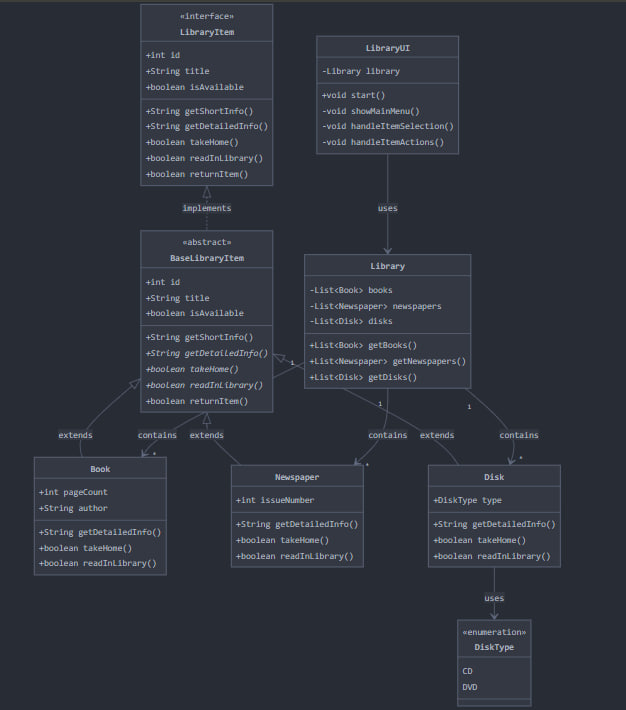
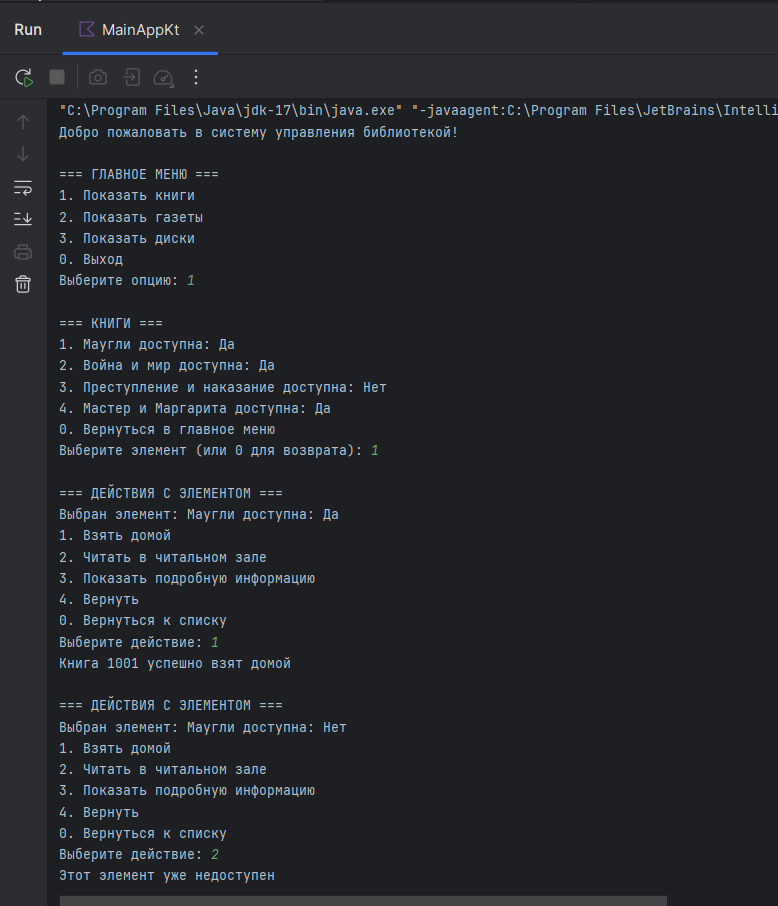

## Задание

## 📚 Система управления библиотекой

Это консольное приложение для управления библиотекой, разработанное на языке Kotlin.
Система позволяет пользователям просматривать книги, газеты и диски, брать их домой или читать в читальном зале, а также возвращать после использования.

### 📌 Описание проекта

Приложение реализует систему управления библиотекой, в которой хранятся различные объекты: книги, газеты и диски. 
Система разработана с соблюдением принципов SOLID и объектно-ориентированного программирования.

### Основные возможности

- Просмотр списка книг, газет и дисков
- Получение краткой и подробной информации о каждом объекте
- Взятие книг и дисков домой
- Чтение книг и газет в читальном зале
- Возврат библиотечных объектов

### Особенности реализации

- Объекты библиотеки имеют общие свойства: id, наименование и доступность.
- Книги дополнительно содержат информацию о количестве страниц и авторе.
- Газеты содержат информацию о номере выпуска.
- Диски имеют тип: CD или DVD.
- Объекты можно взять домой (книги и диски) или читать в читальном зале (книги и газеты).

### 🏗 Структура проекта
```
📂 src
┣ 📂 main
┃ ┣ 📂 java/com/example/Kotlinpart2
┃ ┃ ┣ 📂 data                                            # Модели данных и репозиторий
┃ ┃ ┃ ┣ 📂 datasources
┃ ┃ ┃ ┃ ┣ 📜 InMemoryDataSource.kt                       # Источник данных в памяти
┃ ┃ ┃ ┃ ┗ 📜 LocalDataSource.kt                          # Интерфейс источника данных
┃ ┃ ┃ ┣ 📂 repositories
┃ ┃ ┃ ┃ ┗ 📜 LibraryRepositoryImpl.kt                    # Реализация репозитория библиотеки
┃ ┃ ┣ 📂 domain                                          # Бизнес-логика
┃ ┃ ┃ ┣ 📂 datasources
┃ ┃ ┃ ┃ ┣ 📜 BaseLibraryItem.kt                          # Базовый класс объекта библиотеки
┃ ┃ ┃ ┃ ┣ 📜 Book.kt                                     # Класс книги
┃ ┃ ┃ ┃ ┣ 📜 Disk.kt                                     # Класс диска
┃ ┃ ┃ ┃ ┣ 📜 DiskType.kt                                 # Перечисление типов дисков
┃ ┃ ┃ ┃ ┣ 📜 LibraryItem.kt                              # Интерфейс объекта библиотеки
┃ ┃ ┃ ┃ ┗ 📜 Newspaper.kt                                # Класс газеты
┃ ┃ ┃ ┣ 📂 repositories
┃ ┃ ┃ ┃ ┗ 📜 ILibraryRepository.kt                       # Интерфейс репозитория библиотеки
┃ ┃ ┃ ┣ 📂 usecases
┃ ┃ ┃ ┃ ┗ 📜 LibraryUseCases.kt                          # Класс бизнес-логики
┃ ┃ ┣ 📂 ui                                              # Пользовательский интерфейс
┃ ┃ ┃ ┣ 📂 console
┃ ┃ ┃ ┃ ┣ 📜 LibraryUI.kt                                # Класс для взаимодействия с пользователем
┃ ┃ ┃ ┃ ┗ 📜 MainApp.kt                                  # Класс приложения
┃ ┃ ┃ ┣ 📂 menus
┃ ┃ ┃ ┃ ┣ 📜 ItemActionsMenu.kt                          # Меню действий с объектом
┃ ┃ ┃ ┃ ┣ 📜 ItemSelectionMenu.kt                        # Меню выбора объекта
┃ ┃ ┃ ┃ ┗ 📜 MainMenu.kt                                 # Главное меню
┃ ┃ ┣ 📂 utils                                           # Вспомогательные функции
┃ ┃ ┃ ┃ ┣ 📂 extensions
┃ ┃ ┃ ┃ ┃ ┣ IOExtensions.kt                              # Расширения для ввода/вывода
┃ ┃ ┃ ┃ ┃ ┗ StringExtensions.kt                          # Расширения для строк
┃ ┃ ┗ 📜 MainApp.kt                                      # Точка входа в приложение
```
### Архитектура проекта

Проект разработан с использованием архитектуры `Clean Architecture` и разделен на несколько слоев:

#### UML диаграмма классов для системы


#### 1. Data Layer (Слой данных)

- `InMemoryDataSource` - Реализация источника данных с хранением в памяти
- `LocalDataSource` - Интерфейс источника данных
- `LibraryRepositoryImpl` - Реализация репозитория библиотеки

#### 2. Domain Layer (Доменный слой)

- `LibraryItem` - Интерфейс объекта библиотеки
- `BaseLibraryItem` - Базовый класс объекта библиотеки
- `Book, Newspaper, Disk` - Конкретные типы объектов библиотеки
- `ILibraryRepository` - Интерфейс репозитория библиотеки
- `LibraryUseCases` - Класс бизнес-логики

#### 3. UI Layer (Слой пользовательского интерфейса)

- `LibraryUI` - Класс для взаимодействия с пользователем
- `MainMenu`, `ItemSelectionMenu`, `ItemActionsMenu` - Классы меню
- `IOExtensions`, `StringExtensions` - Расширения для работы с вводом/выводом и строками

### Принципы `SOLID` в проекте

#### Single Responsibility Principle (Принцип единственной ответственности)
- Каждый класс имеет только одну зону ответственности. Например, `Book` отвечает только за представление книги, `LibraryUseCases` - за бизнес-логику, а классы меню - за взаимодействие с пользователем.

#### Open/Closed Principle (Принцип открытости/закрытости)
- Классы расширяемы, но не модифицируемы. Новые типы библиотечных объектов могут быть добавлены без изменения существующих классов.

#### Liskov Substitution Principle (Принцип подстановки Лисков)
- Подклассы `BaseLibraryItem` (такие, как `Book`, `Newspaper`, `Disk`) могут быть использованы вместо базового класса без нарушения функциональности.

#### Interface Segregation Principle (Принцип разделения интерфейсов)
- Интерфейсы в проекте небольшие и специфичные. Например, `LocalDataSource` и `ILibraryRepository` имеют только те методы, которые необходимы для их использования.

#### Dependency Inversion Principle (Принцип инверсии зависимостей)
- Высокоуровневые модули не зависят от низкоуровневых. Зависимости направлены на абстракции, а не на конкретные реализации. Например, `LibraryUseCases` зависит от интерфейса ILibraryRepository`, а не от конкретной реализации.

### Склонировать проект

```
 git clone https://github.com/rudney5000/BaumanTBKotlinOOP
```

### 🚀 Запуск проекта

Открыть проект в Android Studio или другом IntelliJ IDEA

### Запустить MainApp.kt

### 🛠 Технологии

Kotlin

Консольный интерфейс

✨ Пример работы
